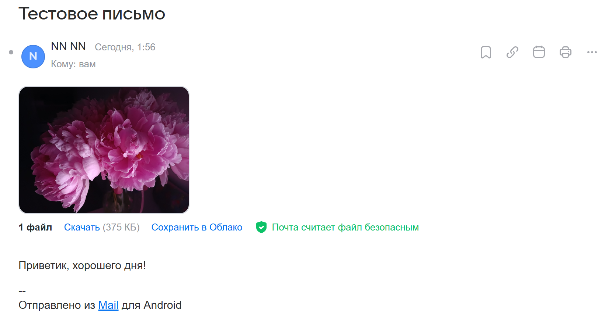
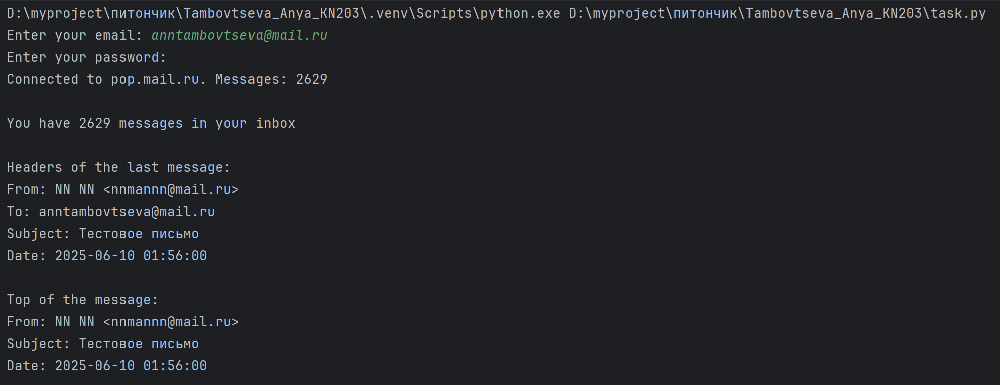
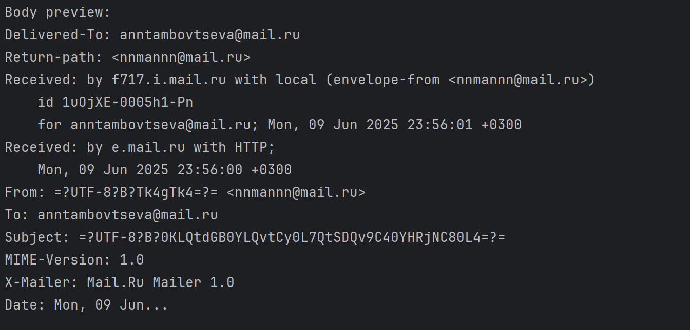
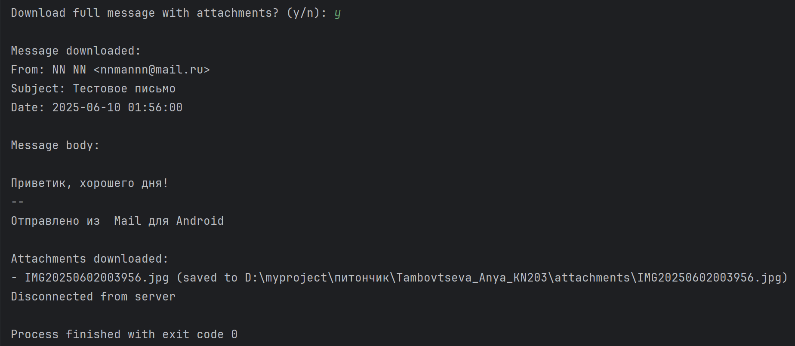

# Тамбовцева Аня КН-203, 6ая задача из файла tasks.pdf
POP3 клиент. Пользователю было послано письмо (на русском или английском языках) на почтовый сервер mail, yandex или google. В письмо было сделано вложение, например, пара картинок.

Пользователь запускает программу для скачивания письма с почтового сервера. Может запросить заголовки: тему, дату, отправителя и т. п. Может запросить TOP (несколько строк) сообщения. Может скачать письмо с вложением.

Пример запуска:

